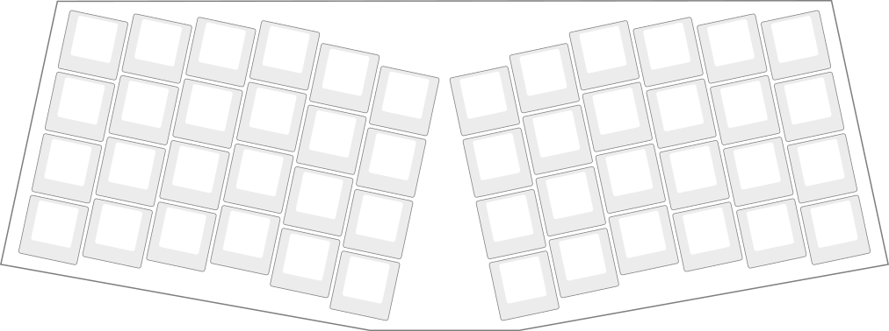

A *hackable* [keyboard](http://venabili.sillybytes.net).

## Why?

I wanted to build a keyboard from the ground up that would be exactly what I
wanted, no more and no less: Custom firmware, custom hardware design, custom
layout, custom everything.

## No, I mean why "Venabili"?

Oh, that! It's named after *Dors Venabili*, a fictional character from Isaac
Asimov's "*Foundation*" series of novels.

## I want it!

For complete information about this keyboard and how to build it, please visit:
[venabili.sillybytes.net](http://venabili.sillybytes.net)
